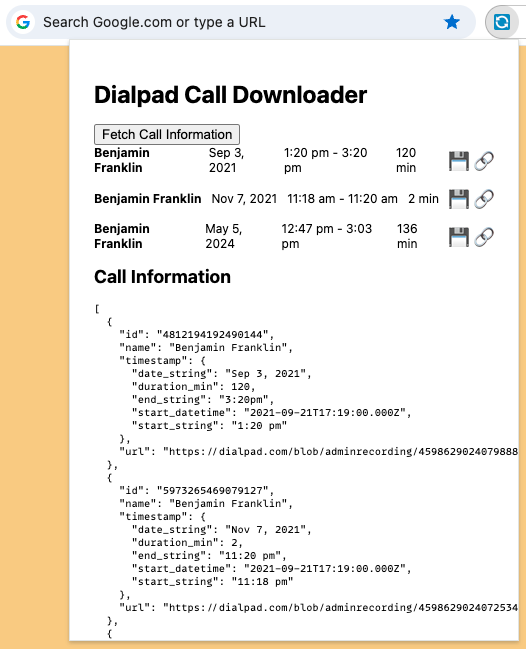

# Dialpad Call Recorder

This extension allows you to fetch call data from Dialpad and download call recordings conveniently, with informational file naming, that includes: Date, Time, and Caller Name. This is useful when you are trying to download numerous call recordings and want to keep them organized.



_This extension was created [from the Chrome/React/TypeScript starter template](https://github.com/CIS-3500/chrome-extension-react-typescript-starter) by [Jérémie Lumbroso](https://github.com/jlumbroso/) based on original work by [Harshita Joshi](https://github.com/Harshita-mindfire)._

## Usage

1. Install the Chrome Extension as per the instruction below, then pin it to the Chrome toolbar.
2. When on a Dialpad call page (you have to have opened a call's detailed view), click on the extension icon, then click "Fetch Call Data".
3. The extension will fetch the call data and display it in the popup window, where you will have the option to download the call recording, copy the link, or export a JSON file representing all calls that have been added.

## Installation

### Install From Release

- Download the latest release from the [Releases](https://github.com/jlumbroso/dialpad-helper-chrome-extension/releases)
- Unzip the downloaded ZIP file
- Open Chrome and navigate to `chrome://extensions`
- Enable "Developer mode"
- Drag and drop the unzipped folder into the extensions page

### Install From Source

1. Clone the repository:

   ```bash
   git clone https://github.com/jlumbroso/dialpad-helper-chrome-extension
   ```

2. Install dependencies:

   ```bash
   cd dialpad-helper-chrome-extension
   npm install
   ```

3. Build the extension:

   ```bash
   npm run build
   ```

4. Load the extension in Chrome:

   - Open Chrome and navigate to `chrome://extensions`
   - Enable "Developer mode"
   - Click "Load unpacked" and select the `dist` directory from the project

## Development

- Run the development server with hot reloading:

  ```bash
  npm run watch
  ```

- Load the unpacked extension in Chrome from the `dist` directory
- Make changes to the source code and the extension will automatically reload

## Chrome Extension Architecture

This project follows the Manifest V3 architecture for Chrome extensions. Key components of the architecture include:

- `manifest.json`: Defines the extension's metadata, permissions, and script configurations
- `background.js`: Runs in the background and handles events and long-running tasks
- `contentScript.js`: Injected into web pages to interact with the DOM and communicate with the background script **(not used here)**
- Popup window: Displays the extension's user interface when the extension icon is clicked

### Manifest V3

This extension is built using the latest version of the Chrome extension manifest (Manifest V3). The `manifest.json` file defines the extension's properties, permissions, and scripts.

Key aspects of the Manifest V3 configuration include:

- `manifest_version`: Set to `3` to use Manifest V3
- `background`: Specifies the background script as a service worker
- `action`: Defines the popup HTML file
- `permissions`: Declares the required permissions for the extension (storage, activeTab, contextMenus)
- `content_scripts`: Specifies the content script to be injected into web pages

## Testing

The project includes a comprehensive testing setup using Jest, Sinon, and sinon-chrome. The tests cover various aspects of the extension, including component rendering, user interactions, and mocking of Chrome APIs.

To run the tests:

```bash
npm run test
```

To generate a coverage report:

```bash
npm run coverage
```

### Mocking Chrome APIs

One of the key aspects of testing a Chrome extension is mocking the Chrome APIs. This project uses the following libraries to achieve this:

- [Jest](https://jestjs.io/): The test runner and assertion library
- [Sinon](https://sinonjs.org/): A library for creating spies, stubs, and mocks
- [sinon-chrome](https://github.com/acvetkov/sinon-chrome/): A collection of pre-built mocks for Chrome APIs
- [jest-sinon](https://github.com/djkf/jest-sinon): An extension for Jest to work seamlessly with Sinon

Here's an example test that demonstrates mocking the Chrome storage API:

```typescript
it("sets initial state with empty array when snippets key is an empty array in local storage", async () => {
  chrome.storage.local.get.withArgs("snippets").yields({ snippets: [] });

  render(<App />);
  const snippetElements = screen.queryAllByRole("listitem");
  expect(snippetElements).toHaveLength(0);
});
```

In this test, we mock the `chrome.storage.local.get` method to return an empty array for the 'snippets' key. This allows us to test how the `App` component behaves when there are no saved snippets.